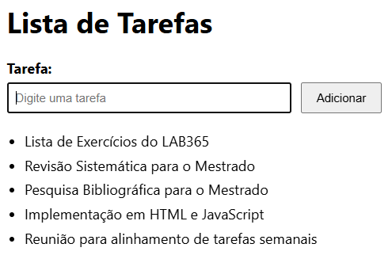

# [M02S05] Ex.: 03 – Lista de Tarefas

Exercício para praticar manipulação do DOM e eventos em JavaScript.

## Objetivo
Criar uma página de lista de tarefas com:
- Um título **Lista de Tarefas** (`<h1>`);
- Um campo de entrada (input) e um botão **Adicionar**;
- Sempre que o botão for clicado (ou pressionar Enter no input), adicionar o texto à lista exibida abaixo.

## Como executar
1. Abra `index.html` no navegador.
2. Digite uma tarefa no campo de texto.
3. Clique em **Adicionar** (ou pressione Enter).
4. A tarefa aparecerá na lista abaixo.

## Resultado 
